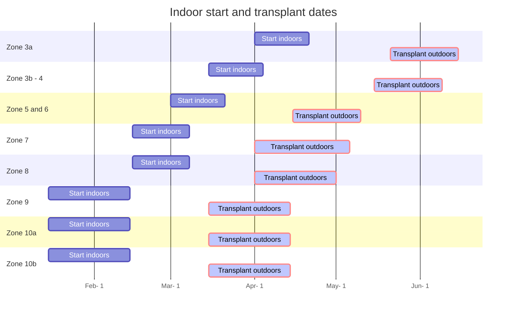
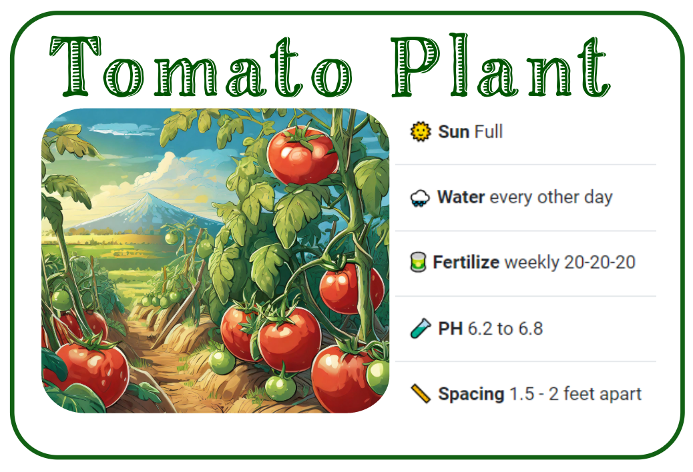

---
# Title, summary, and page position.
linktitle: 🍅 Tomatoes
summary: Learn how to grow tomatoes
weight: 1
icon: #book
icon_pack: fas
show_date: true
share: true
# Page metadata.
title: 🍅 Tomato growing guide
date: '2018-09-09T00:00:00Z'
type: book # Do not modify.
lastmod: '2018-09-09T00:00:00Z'

---


-----

#### 📣 At a glance


```markmap {height="350"}
- 🍅**Tomato** plants at a glance
  - 🌞 **Sun** Full 
  - 🌧️ **Water** every other day, leaves wilting clear sign of
  needed watering
  - 🥫 **Fertilize** weekly 20-20-20 at 
  ~150-200 ppm at full size
  - 🧪 **PH** 6.2 to 6.8
  - 📏 **Spacing** 1.5 - 2 feet apart per plant

```

---

## Introduction

{}
Tomatoes are one of my favorite plants to grow. Depending on the type of tomato plant, each plant may produce anywhere from 20-35 lbs of tomatoes per plant anually. There are many types to consider. The following are brief list of common tomato types that I have grown:

- **cherry tomatoes**: perfect for snacking, makes salad prep quick and easy
- **san marzanos**: excellent for tomato sauces for pasta dishes and pizza. They have a mild and sweet flavor
- **big beef tomatoes**: perfect for burgers, bacon lettuce tomato (BLT) sandwiches, salsa, caprese salad. Provides a firm texture with crisp and flavor.
- **sakura tomatoes**: all around medium size tomatoes for many different uses


Tomatoes can also be Indeterminate  or Determinate.
- **Indeterminate tomatoes** continue to grow while producing fruit.
- **Determinate tomatoes** grows all fruit at a given time and ripens all together. The plant is typically finised afterwards.

Check the section NJ Zone 7 Seed link on the right regarding typical tomato varieties that grow well in NJ. I will update when I can locate similar lists for other zones. 
{}


---
## Starting
Tomato seeds should be started in 50 count trays. A tray is roughly about  21¼" x 11¼" x 2¼" or 19.6" x 9.75". Each cell within in the tray has dimensions: 1¾" x 1¾-2.72". This will provide each tomato seedling with ~4-6 weeks of growth. Larger size containers like egg cartons, small plastic cups can also be used, however the larger the starting container, the potential waste of space if something were to go wrong. Also, try not to plant tomoato seeds in smaller containers. They will out grow the space quickly which would requiring tranferring the young seedlings to larger size pots. More handling of the young fragile seedlings = greater risk of damage, resulting in slow wilt, then eventual trip to the compost bin.

Utilze potting soil that can be purchased from major retailers like lowes/home depot/walmart/aldis/target. The bagged soil should be labled potting soil. Potting soil is most suitable for seed germination due to its drainage capacity. Bags labeled garden soil or dirt will not allow good drainage in containers. Water drainage in containers are required to prevent water stagnation. Stagnated water can eventually suffucate and rot plant roots.

Within each cell/container plant a single tomato seed. If you only have a few containers and many seeds,  go ahead and plant 2-3 seeds per small container. If/When all the seeds sprout, cut the extra seedlings and leave a single plant to continue to grow. 

During this stage, ensure the top soil area is kept moist. Use a spray bottle to water the top or gently pour water being carefuly not to wash away the seeds and disrupt the soil. A plastic dome works well in keeping a moist environment.

A heating mat is  recommended. Temeperatures around 75-80 helps with speeding up germination, otherwise temps in the 60s will prolong it. Light is also not as important for germination at this stage. However, a strong light source IS required as soon as the seeds sprout. Without a suitable light source that provides what plants require, will result in leggy stretched seedlings. From my experience, leggy/stretched seedlings eventually die. 




-----
## Seedling stage
When the plant first emerges from seed, the first leaves are called 'false' leaves known as Cotyledons.  The picture below is about 10 days from initial planting: 




The young plant will continue to grow until 'true' leaves appear. See below of tomato true leaves appearing after 8 days:





During this time, it is recommended to provide 14-16 hours of light. Keep with watering such that soil is moist and not overly saturated and  fertilize after ~2 weeks. 50 PPM of general fertilizer 20-20-20 once a week.

---

## Transfer
After about a month of growth, the tomato plants will begin to look as pictured below. I simply kept with fertilizing, exposure to lights, and watering. At this stage, tomatoes may be prepped for transfer into the ground. 

Before hand, ensure the dangers of **frost** are over with. I generally wait till temperatures are consistently around 60 F degrees.




Below is a picture of tomato plants transferred to 4 inch pots. It was a cold/rainy spring in 2023 zone 7. In addition to a busy scedule, I was unable to prep the garden beds. Thefore, potting the plants into larger pots provide for more growth and time.  




Prior to transferring into the ground, ensure that tomato plants are acclimated to sun exposure. Plants can be brought under direct sunlight for 1-3 hours (start with less and gradually increas the time) and then returned under shade or brought back indoors. 


## Harvest


## Notes


### Gallery


### Tomato planting zones and start dates





### NJ Zone 7 seed list: 

A recommended list of tomatoes that grow well in NJ, provided by 
[Rutgers University](https://njaes.rutgers.edu/fs678/)

| Season      | Variety                                                                                 | Days to Maturity | Vine Type        | Disease Resistance | Fruit Size (oz.) |
| ----------- | --------------------------------------------------------------------------------------- | ---------------- | ---------------- | ------------------ | ---------------- |
| Early       | [Early Girl](https://njaes.rutgers.edu/tomato-varieties/variety.php?Early+Girl)         | 50               | Indeterminate    | V,F                | 4                |
|             | [Early Goliath](https://njaes.rutgers.edu/tomato-varieties/variety.php?Early+Goliath)   | 58               | Semi-determinate | V,F,N              | 8                |
|             | [Fourth of July](https://njaes.rutgers.edu/tomato-varieties/variety.php?Fourth+of+July) | 49               | Indeterminate    | V,F,N,T            | 4                |
|             | [Moreton](https://njaes.rutgers.edu/tomato-varieties/variety.php?Moreton)               | 70               | Indeterminate    | V                  | 8                |
|             | Red Deuce                                                                               | 72               | Determinate      | V,F,T              | 10               |
|             | [Sunstart](https://njaes.rutgers.edu/tomato-varieties/variety.php?Sunstart)             | 66               | Determinate      | V,T                | 10               |
| Mid-Season  | [Better Boy](https://njaes.rutgers.edu/tomato-varieties/variety.php?Better+Boy)         | 75               | Indeterminate    | V,F,N              | 12               |
|             | [BHN 589](https://njaes.rutgers.edu/tomato-varieties/variety.php?BHN+589)               | 75               | Determinate      | V,F,TMV            | 7                |
|             | [Big Beef](https://njaes.rutgers.edu/tomato-varieties/variety.php?Big+Beef)             | 70               | Indeterminate    | V,F,N,TMV          | 10               |
|             | [Big Boy](https://njaes.rutgers.edu/tomato-varieties/variety.php?Big+Boy)               | 78               | Indeterminate    |                    | 16               |
|             | [Celebrity](https://njaes.rutgers.edu/tomato-varieties/variety.php?Celebrity)           | 72               | Semi-determinate | V,F,N,T            | 10               |
|             | [Jet Star](https://njaes.rutgers.edu/tomato-varieties/variety.php?Jet+Star)             | 72               | Indeterminate    | V,F                | 10               |
|             | [Mountain Magic](https://njaes.rutgers.edu/tomato-varieties/variety.php?Mountain+Magic) | 66               | Indeterminate    | V,F,EB             | 2                |
|             | [Red Defender](https://njaes.rutgers.edu/tomato-varieties/variety.php?Red+Defender)     | 75               | Determinate      | V,F,T              | 8                |
|             | [Rutgers 250](https://njaes.rutgers.edu/tomato-varieties/variety.php?Rutgers+250)       | 74               | Semi-determinate |                    | 10               |
|             | [Scarlet Red](https://njaes.rutgers.edu/tomato-varieties/variety.php?Scarlet+Red)       | 73               | Determinate      | V,F                | 12               |
|             | [Sunbrite](https://njaes.rutgers.edu/tomato-varieties/variety.php?Sunbrite)             | 75               | Determinate      | V,F                | 10               |
| Late Season | [Ramapo](https://njaes.rutgers.edu/tomato-varieties/variety.php?Ramapo)                 | 85               | Indeterminate    | V,F                | 12               |


## References
http://extension.msstate.edu/content/how-much-yield-can-i-expect-plant

