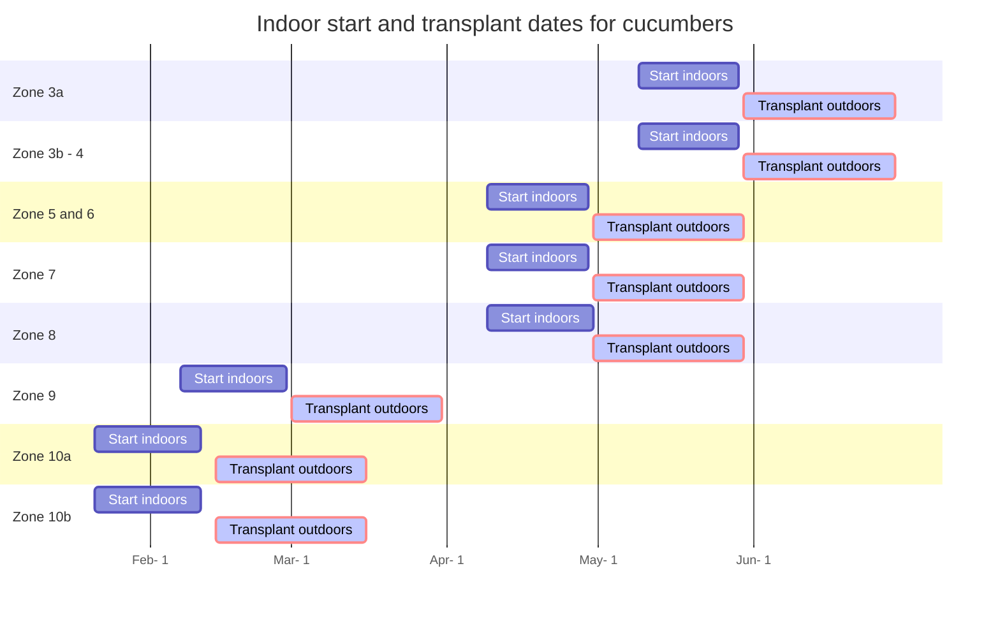

#### 📣 At a glance

```markmap {height="300px"}
- 🍅**Tomato plants**
  - 🌞 **Sun** Full 
  - 🌧️ **Water** Every other day, if leaves
      are wilting = add water
  - 🥫 **Fertilize** Weekly with 20-20-20 at 
          ~150-200 ppm at full size, or utilize fertilizer 
          calculator below 
  - 🧪 **PH** 6.0 to 6.8
  - 📏 **Spacing** at least 1.5-2 Feet between cucumber plant
  - 🧹 **Maintenance** Trellis and guide vines to safe position,
            harvest cucumbers at picking size which avoids plant
            deterioration

```

---

## Introduction
{}
Cucumbers are what I consider a foundation vegetable like tomatoes. They make wonderful side dishes to go with steak/chicken, simple to add to salads, and make healthy green juices. Cucumber plants can yield  anywhere from 20-25 lbs per plant annually. The cucumber types I have grown successfully are called Unagi, marketmore, and Gershin. Unagi is a long style cucumber with thin skin, the kind that are seen at BJs/Costco but taste MUCH better! Marketmore is a thicker cucumber, with thicker skin that allows for longer storage. The Gershin cucumber is a pickling cucumber, short and stocky, and makes excellent pickles for sandwiches/burgers.  

Cucumbers can range in length from 3 inches to over 13 inches, vary by sweetness/bitterness, and harvesting . 


This guide will provide an overview of how to grow cucumbers.
{}


---

## Starting

First step is to determine your Zone. [Click here to access the zone map 🗺](/docs/zones/) or on the left to get your zone information. The dates below are  guidelines as to when the best time of year to start the cucumber seeds. If they are started too early indoors, may not have enough space and light output to continue the growth of cucumber plants in larger containers. If starting too late, may not have enough time to obtain successful yields or the young plants may not manage well under the hot summer sun.  


### Start dates




### Sizing
Cucumber seeds should be started in 32 or 50 count trays. A tray is roughly about  21¼" x 11¼" x 2¼" or 19.6" x 9.75". Each cell within this tray has dimensions: 1¾" x 1¾-2.72". 32 inch size tray are typically around 2" inch square. This will provide each cucumber seedling with ~3-4 weeks of growth. Also, try not to plant cucumber seeds in smaller containers. They will out grow the space quickly which would requiring transferring the young seedlings to larger size pots. More handling of the young fragile seedlings = greater risk of damage, resulting in slow wilt, then eventual trip to the compost bin.


### Soil and seeding
Utilize potting soil that can be purchased from major retailers like lowes/home depot/walmart/aldis/target. The bagged soil should be labeled potting soil. Potting soil is most suitable for seed germination due to its drainage capacity. Bags labeled garden soil or dirt will not allow good drainage in containers. Water drainage in containers are required to prevent water stagnation. Stagnated water can eventually suffocate and rot plant roots.

Within each cell/container plant a single cucumber seed. If you only have a few containers and many seeds,  go ahead and plant 2 seeds per small container. If/When all the seeds sprout, cut the extra weaker looking seedlings and leave a single plant to continue to grow. 

During this stage, ensure the top soil area is kept moist. Use a spray bottle to water the top or gently pour water being careful not to wash away the seeds and disrupt the soil. A plastic dome works well in keeping a moist environment.

A heating mat is recommended. Temperatures around 75-80 helps with speeding up germination, otherwise lower temps in the 60s will prolong it. Light is also not as important for germination at this stage. However, a strong light source IS required as soon as the seeds sprout. Without a suitable light source that provides what plants require, will result in leggy stretched seedlings. From my experience, leggy/stretched seedlings eventually tip over and wither. 





{}

During this stage, not much excitement. I typically check the soil moisture first thing in the morning and again in the evening. If its a little dry, I use the misting bottle to reapply water. Sprouting can happen within a week or less using a heat mat. 

{}


-----
## Seedling stage
When the plant first emerges from seed, the first leaves are called 'false' leaves known as Cotyledons.  The picture below is about 18 days from initial planting of the cucumber seed: 




The young plant will continue to grow and produce 'true' leaves. See below of true leaves of cucumber plants. The is how fast they can grow after ~3 weeks:





During this time, it is recommended to provide 14-16 hours of light. Keep with watering via bottom tray such that soil is moist and not overly saturated. Fertilize at this stage by applying 50 PPM of general fertilizer 20-20-20 once a week [^1]


---


## References
[^1]:[www.aces.edu/blog/topics/crop-production/greenhouse-cucumber-production/](https://www.aces.edu/blog/topics/crop-production/greenhouse-cucumber-production/) 
[^2]:[ucdavis cucumbers](https://www.wifss.ucdavis.edu/wp-content/uploads/2016/05/FDA_WIFSS_-Cucumbers_PDF.pdf)
