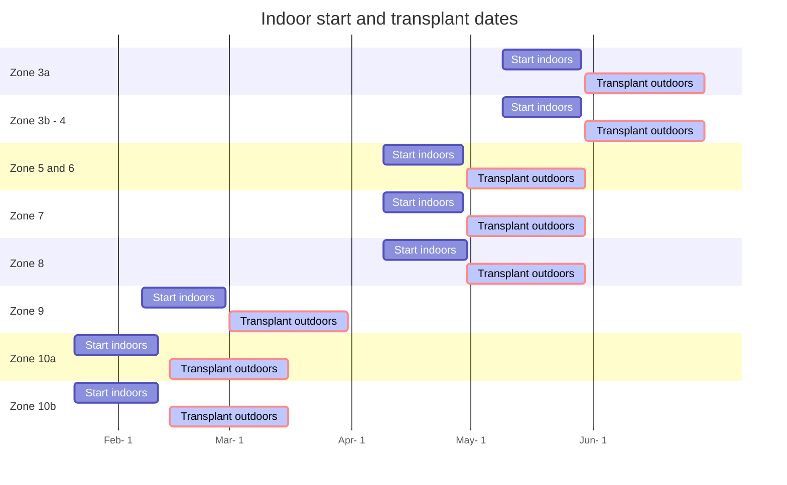

Coming soon


#### 📣 At a glance

```markmap {height="300px"}
- 🍅**Tomato plants**
  - 🌞 **Sun** Full 
  - 🌧️ **Water** Every other day, if leaves
      are wilting = add water
  - 🥫 **Fertilize** Weekly with 20-20-20 at 
          ~150-200 ppm at full size, or utilize fertilizer 
          calculator below 
  - 🧪 **PH** 6.0 to 6.8
  - 📏 **Spacing** at least 1 Feet between cucumber plant
  - 🧹 **Maintenance** Every few days, clear 
          weeds, prune suckers

```

---

## Introduction
{}
Cucumbers are what I consider a foundation vegetable like tomatoes. They make wonderful side dishes to go with steak/chicken, simple to add to salads, and make healthy green juices. Cucumber plants can yield  anywhere from 20-25 lbs per plant annually. The cucumber types I have grown successfully are called Unagi and Gershin. Unagi is a long style cucumber, the kind that are seen at BJs/Costco but taste MUCH better! The Gershin cucumber is a pickling cucumber. They are short and stocky, make excellent pickles for sandwiches/burgers.  

This guide will provide an overview of how to grow cucumbers.
{}


---

## Starting

First step is to determine your Zone. [Click here to access the zone map 🗺](/docs/zones/) or on the left to get your zone information. The dates below are  guidelines as to when the best time of year to start the cucumber seeds. If they are started too early indoors, may not have enough space and light output to continue the growth of tomato plants in larger containers. If starting too late, may not have enough time to obtain successful yields or the young plants may not manage well under the hot summer sun.  


### Start dates





## References
- [ucdavis cucumbers](https://www.wifss.ucdavis.edu/wp-content/uploads/2016/05/FDA_WIFSS_-Cucumbers_PDF.pdf)